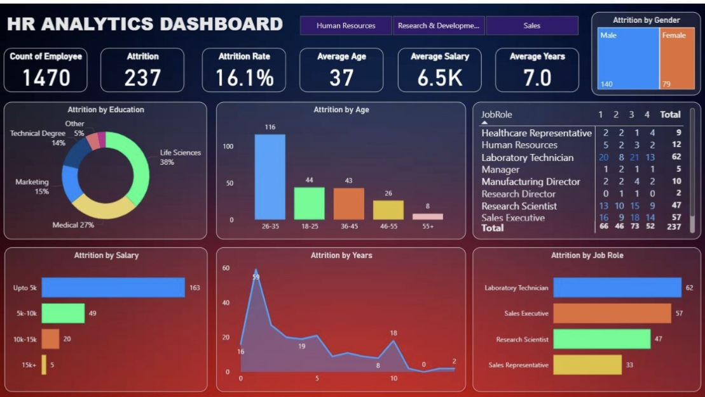

# HR-Analytics-Dashboard
## 📌 Overview
Interactive Power BI dashboard exploring employee attrition (rate **16.1%**), average age (**37**), average salary (**6.5k**), and tenure (**7.0** years), segmented by gender, education, salary bands, age groups, and job roles.

## 🔍 Key Insights
- Highest attrition in **26–35** age group.
- Salary band **Up to 5k** drives most attrition.
- Roles with most attrition: **Laboratory Technician**, **Sales Executive**.
- Education mix led by **Life Sciences**.

## 💡 Recommendations
1. Targeted retention for **26–35** age band and **Up to 5k** salary band.
2. Career-pathing & compensation reviews for **Lab Tech** and **Sales Executive** roles.
3. Track attrition trend YoY and run A/B on benefits changes.

## 🧰 Tech Stack
Power BI · DAX · Power Query · Excel · Data Modeling
